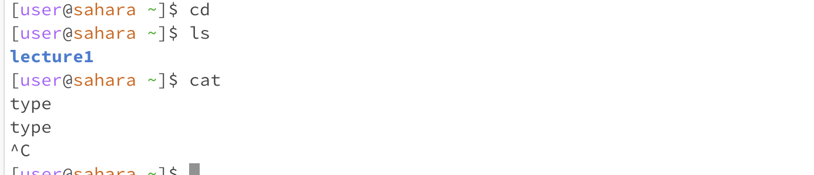
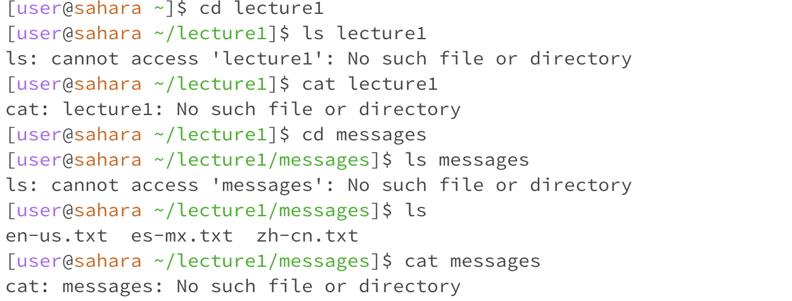
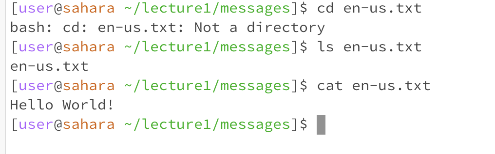

Lab Report 1

When cd was run, the directory we were in was in lecture 1, and when ls was run the directory was shown, lecture 1, and when cat was run, there was no directory that it was being run on. I got no output for cd because I didnt choose a path to go to, that wha CD is for. when LS was run, it told me what directory I was in currently, And when CAT was run I didnt get anything because I didnt give it a path to read.

When CD was run, the directory was still lecture 1, and when ls was run it was in lecture 1 still, and cd the same, the output for CD lecture1, caused it so the working directory was now lecture 1, and since we cant ls a directory we are in, that why I got an error code, and cat was not able to pick out the contents within lecture 1.

When cd was run, we were inside lecture 1 working directory, and when we cd to mesasges, that caused us to be within that path, ls messages showed us what was within lecture 1, but we got an error at first because we were trying to see what was inside a path we were in, and once again, we got an error for cat because it was unable to pick out the contents of messages, 
once we choose the cd to be a specfic file, it was unable to do so because we were looking for another directory, not a file, and ls the file also just showed us what was in the file, the file itself so thats why we got that ouput. And finally, when we used cat on the file, it read out the contents wihin that file.
